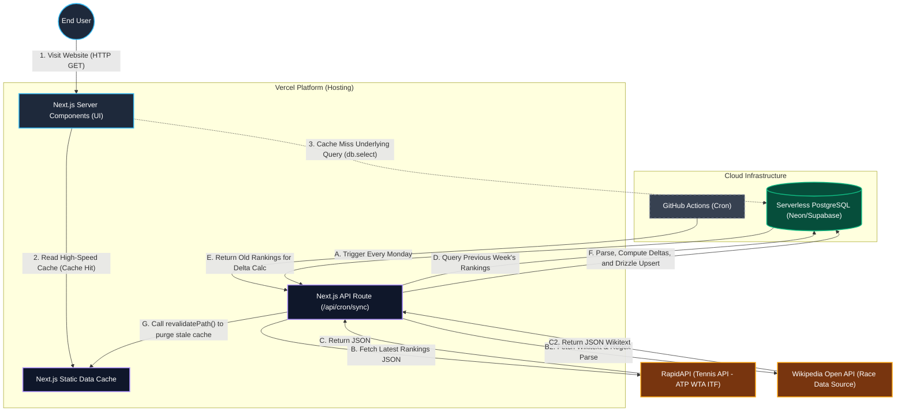

# 🏗 PROJECT SPEC (Technical Architecture Specification) - VTAWEB

> **💡 Antigravity SPEC Positioning Statement**
> This is the engineering "skeleton" and technical "constitution" during the project's runtime. It is the highest-level directive zone designed specifically for AI Agents (Next-Gen Code Generation Models). It must be extremely precise, concise, and highly constrained to ensure zero entropy increase even after hundreds of automated iterations.

---

## 1. 🛠 Tech Stack & Core Dependencies
*(Locks down stack versions to prevent AI from hallucinating non-existent packages or APIs during generation)*

- **Frontend**: Next.js 15 App Router (React 19 Server Components preferred).
- **Backend / API**: Next.js API Routes (for CRON ingestion) + Server Components (for data fetching).
- **Database / ORM**: PostgreSQL (Serverless DB e.g., Supabase / Neon) + Drizzle ORM.
- **Styling**: Vanilla CSS with strong CSS Variables and Glassmorphism aesthetics.
- **CI/CD & Scheduler**: GitHub Actions (for weekly automated data sync triggers).
- **Deployment**: Vercel (Next.js hosting edge/serverless functions).

## 2. 🗺 Architecture Topology
*(Defines the core purpose of the project directory and code layering, ensuring Agents do not arbitrarily drop files)*

```text
src/
├── app/               # [NO BUSINESS COMPONENTS] Retain only Routing entries, Layouts, and SEO metadata.
├── components/        
│   ├── features/      # [Business Level] Domain-isolated heavy business components (e.g., RankingsContainer, TournamentCard).
├── lib/               # [Side-Effect Free Zone] Pure function utilities (utils.ts) and local Mock Data.
└── server/            # [Secure Isolated Zone] Server-only environment for DB instance mounting (Drizzle client) and schemas.
```

## 2.5 🕸 Data Flow Architecture
*(Full-stack topological visualization detailing the flow from "Trigger -> API -> Source -> Database -> UI")*



## 3. 🔌 API Contracts & Routes
*(Explicitly defines routing standards and data interaction contracts)*

- **Page Routes**:
  - `/` -> Global Landing Dashboard (Top 10 Rankings & Live Tournaments)
  - `/rankings` -> Full Rankings Page (Dual-Track Toggle)
- **Data Channel Principles**:
  - **Data Fetching**: Pure Server-Side Rendering (Server Components) directly invoking `db.select()` to inject into pages.
  - **Data Ingestion**: Internal secure interface `/api/cron/sync` triggered by GitHub Actions to ingest external RapidAPI and Wikipedia data.

## 4. 🗃 Data Retention Policy
*(Declares the core database table design intent and garbage collection mechanisms)*

- **Core Entities**: `rankings`, `tournaments`.
- **Retention Strategy**: To control database costs and performance, the system routinely truncates or overwrites data via the CRON sync pipeline. During weekly syncs, a full table `DELETE` followed by a batch `INSERT` guarantees absolute data purity without relying on infinite storage growth.

## 5. 🛡 Security Redlines
*(AI is strictly prohibited from generating any code containing these vulnerabilities)*

- **CRON Interface Authorization**: `/api/cron/sync` MUST strictly validate `Authorization: Bearer CRON_SECRET` in the HTTP Header to prevent external requests from flooding the database.
- **Edge Computing Contamination**: Strictly forbid accidentally printing sensitive environment variables inside Server Client Components.

---

## 6. 🧠 Architecture Thought Log
*(Append Only Zone. Records major architectural trade-offs between Humans and AI during project evolution, serving as contextual diagnostic memory for future Agents)*

- **[2026-06-10] [Decision]**: Decided to adopt PostgreSQL + API data sources, abandoning pure static Mock Data.
  - *Context*: As a high-level technical Demo, it needs to cover the full stack (data flow, database, cron jobs).
  - *Trade-off*: Introduced database reliance, but solved via a cost-free Serverless Postgres + Weekly Wipe & Upsert strategy.
- **[2026-06-10] [Decision]**: Dynamically computing week-over-week deltas (+/-).
  - *Context*: Some APIs don't track weekly changes.
  - *Execution*: Built an algorithmic pipeline inside the Vercel API to memory-map the top 2 historical dates, calculating the precise ranking change before persistence.
- **[2026-06-10] [Decision - *Deprecated (v2.0)*]**: Consolidated the "Race to Turin/Finals" web scraper into the Next.js API route.
  - *Context*: Needed Race rankings alongside the 52-week standard rankings, but standard API sources don't cover live Race points.
  - *Trade-off*: Wrote a custom Regex parser for Wikipedia's raw Wikitext API in TypeScript. This eliminated the need for a separate Python scraper pipeline, centralizing all DB ingestion directly inside the Next.js edge environment for architectural purity.
- **[2026-06-10] [Decision - *Deprecated (v2.0)*]**: Leveraged Wikipedia Revision API for week-over-week tracking.
  - *Context*: Calculating the `+/-` delta for Race rankings requires historical data, but the DB overwrites daily/weekly to save space.
  - *Execution*: Instead of building a complex historical snapshotting system in PostgreSQL, the backend calculates exactly `T-7 days`, queries Wikipedia's Revision History API for the exact wikitext from a week ago, and compares it in-memory against today's parsed data.
- **[2026-06-30] [Decision - *Current (v3.0)*]**: Migrated core data source from Jeff Sackmann CSVs to RapidAPI.
  - *Context*: The original open-source CSV repository became highly unstable (frequent 404s), causing the automated CRON pipeline to fail.
  - *Trade-off*: RapidAPI provides reliable current standard rankings but lacks historical `movement` data natively. We accepted this to guarantee pipeline uptime and data integrity.
- **[2026-06-30] [Decision - *Current (v3.0)*]**: Implemented Database-Native Week-over-Week Delta (`+/-`) Computation.
  - *Context*: Because RapidAPI doesn't provide rank changes, and the Wikipedia Revision API proved too fragile and complex, we required a unified, robust way to calculate deltas without making redundant external network requests.
  - *Execution*: Modified the Next.js API to fetch the *previous* week's state directly from Supabase *before* performing the weekly wipe. The delta is dynamically computed (`oldRank - newRank`) in-memory. If the synchronization occurs multiple times within a 4-day window, the system intelligently preserves the existing delta to prevent resetting to 0. This drastically simplified the architecture and allowed us to drop the legacy Wikipedia Revision API scraper entirely.
