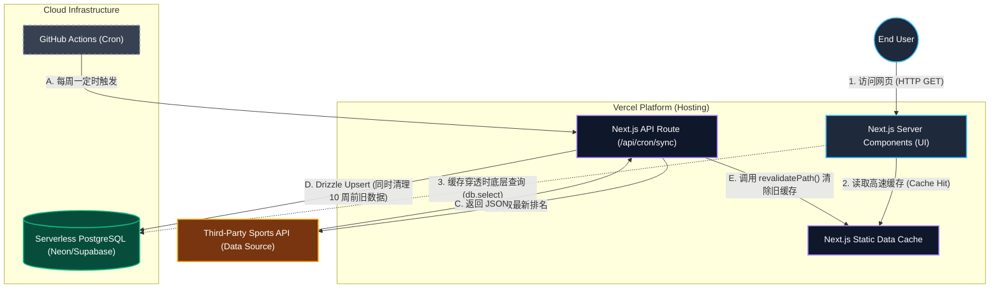

# 🏗 PROJECT SPEC (Technical Architecture Specification) - VTAWEB

> **💡 Antigravity SPEC 定位声明**
> 这是项目运行期的工程“骨架”与技术“宪法”。它是最高级指令区，专门服务于 AI Agent (如下一代代码生成模型)。它必须极其精确、无废话、强约束，确保历经数百次自动迭代后，系统架构不产生丝毫的熵增。

---

## 1. 🛠 核心技术栈 (Tech Stack & Core Dependencies)
*（明确固定技术栈版本，防止 AI 在生成代码时自我幻觉出不存在的包或 API）*

- **Frontend**: Next.js 15 App Router (React 19 Server Components preferred).
- **Backend / API**: Next.js API Routes (for CRON ingestion) + Server Components (for data fetching).
- **Database / ORM**: PostgreSQL (Serverless DB e.g., Supabase / Neon) + Drizzle ORM.
- **Styling**: Vanilla CSS with strong CSS Variables and Glassmorphism aesthetics.
- **CI/CD & Scheduler**: GitHub Actions (for weekly automated data sync triggers).
- **Deployment**: Vercel (Next.js hosting edge/serverless functions).

## 2. 🗺 架构拓扑树 (Architecture Topology)
*（定义工程目录的核心意义与代码分层，确保 Agent 不会随意丢放文件）*

```text
src/
├── app/               # [严禁放置业务组件] 仅保留路由入口、Layout 和 SEO metadata。
├── components/        
│   ├── features/      # [业务级] 按领域隔离的重业务态组件 (如 RankingsContainer, TournamentCard)。
├── lib/               # [无副作用层] 纯函数工具库结构 (utils.ts) 与本地 Mock Data。
└── server/            # [安全隔离区] 仅供 Server 环境执行的 DB 实例挂载 (Drizzle client) 与 schema。
```

## 2.5 🕸 数据流转架构图 (Data Flow Architecture)
*（全栈链路的可视化呈现，标明“触发器 -> 接口 -> 数据源 -> 数据库 -> UI”的流向）*



## 3. 🔌 接口协议与路由树 (API Contracts & Routes)
*（明确路由规范与数据交互契约）*

- **页面路由**:
  - `/` -> 全局落地页 Dashboard (Top 10 Rankings & Live Tournaments)
  - `/rankings` -> 完整排名页面 (双轨 Toggle)
- **数据通道原则**:
  - **Data Fetching**: 纯服务端渲染 (Server Components) 直接调用 `db.select()` 注入页面。
  - **Data Ingestion**: 内部安全接口 `/api/cron/sync` 供 GitHub Actions 定时调用，获取第三方体育 API 数据。

## 4. 🗃 系统状态与数据保留策略 (Data Retention Policy)
*（声明最核心的数据库表结构意图与垃圾回收机制）*

- **核心实体**: `rankings`, `tournaments`。
- **Rolling Window (滚动窗口) 策略**: 为控制数据库成本，系统仅保留最近 10 周的数据记录。每周数据同步时，自动执行 `DELETE` 清理 `updated_at` 超期的废弃数据。

## 5. 🛡 架构级安全防御 (Security Redlines)
*（禁止 AI 生成任何包含以下漏洞的代码）*

- **CRON 接口鉴权**: `/api/cron/sync` 必须严格校验 HTTP Header 中的 `Authorization: Bearer CRON_SECRET`，防止任意外部请求刷爆数据库。
- **边缘计算污染**: 禁止在 Server Client Component 中意外打印敏感环境变量。

---

## 6. 🧠 决策轨迹挂载点 (Architecture Thought Log)
*（Append Only 区。用于记录人类与 AI 在项目演进过程中的重大架构取舍，为未来的 Agent 提供上下文诊断记忆）*

- **[2026-06-10] [Decision]**: 决定采用 PostgreSQL + 真实数据源，放弃纯静态 Mock Data。
  - *Context*: 作为高级技术 Demo，需要涵盖全栈（数据流、数据库、定时任务）。
  - *Trade-off*: 引入了数据库成本，但通过 10-week Rolling Window 策略完美解决了数据库膨胀问题。
